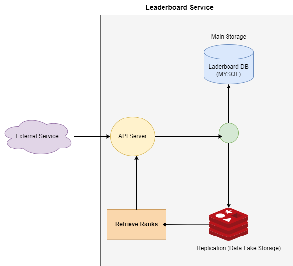

# Leaderboard API Service

This document provides the setup information and an overview of the available API endpoints for the Leaderboard service. The API allows for the retrieval, creation, and updating of leaderboard entries.


## Table of Contents

1. [Introduction](#introduction)
2. [Diagram](#diagram)
3. [Service Setup](#project-setup)
4. [Create Admin User](#useradmin)
5. [Authentication](#authentication)
6. [Leaderboard Endpoints](#leaderboard-endpoints)
   - [Create Leaderboard](#create-leaderboard)
   - [Get Leaderboard list](#get-leaderboards-list)
   - [Delete Leaderboard (Soft Delete)](#delete-leaderboard)
   - [Enable Leaderboard](#enable-leaderboard)
   - [Adding or update users in leaderboard](#adding-users-into-a-leaderboard)
   - [Get player rank](#get-player-rank)
   - [Get leaderboard ranks](#get-leaderboard-ranks)
   - [Get ranks around a player](#get-ranks-around-a-player)


## Introduction

The Leaderboard API provides a set of RESTful endpoints to interact with leaderboard data. You can use these endpoints to fetch, create, and update leaderboard entries.

## Diagram

 

 

## Project Setup
  
  1. Docker is required (It must be installed fisrt!)

  2. Start Services:

    ```bash
    docker-compose up mysql redis phpserv
    ```
  
  3. Fillup database with a seeder script (wait until services above gets fully started):

    ```bash
    docker-compose up seeder
    ```

    Note: 3 Million User is set by default. You can change this valie in variable PLAYERS_LIMIT in /seeder .env file.

  4. Running the api automated tests (wait until seeder ends the fillup process):

    ```bash
    docker-compose up tavern-tests

    Expected Response:

    tavern_api_tests  | tests/test_t1000_api_index.tavern.yml::Leaderboard Service Index PASSED  [14%]
    tavern_api_tests  | tests/test_t1001_api_leaderboard.tavern.yml::Leaderboard List PASSED     [28%]
    tavern_api_tests  | tests/test_t1002_api_lederboard.tavern.yml::Leaderboard Create PASSED    [42%]
    tavern_api_tests  | tests/test_t1003_api_lederboard.tavern.yml::Leaderboard Disable and Enable PASSED [57%]
    tavern_api_tests  | tests/test_t1004_api_lederboard_payers.tavern.yml::Leaderboard Add and Update Players Scores PASSED [71%]
    tavern_api_tests  | tests/test_t1006_api_lederboard_payers.tavern.yml::Leaderboard Get Players PASSED [85%]
    tavern_api_tests  | tests/test_t1007_api_lederboard_payers.tavern.yml::Leaderboard Get Rank Around Player PASSED [100%]

    ```

## Create admin user
  An admin user is required to create a Bearer Token quired into each leaderboard service endpoint.
  Here is the way how create it:

  ```http
  POST http://127.0.0.1:8000/api/admin/users
  Content-Type: application/json
  Accept: application/json

  Request Body:

  {
      "name": "admin3",
      "email": "admin3@email.com",
      "password": "12345"
  }

  Response:
  {
      "user": {
          "name": "admin",
          "email": "admin@email.com",
          "updated_at": "2024-08-06T23:11:43.000000Z",
          "created_at": "2024-08-06T23:11:43.000000Z",
          "id": 3
      }
  }

```

  
## Authentication
All leaderboard endpoints require authentication via an API key. You can obtain your API key by registering on our platform. Pass the API key in the request headers as follows:

  ```http
  POST http://127.0.0.1:8000/api/admin/users/token HTTP/1.1
  Content-Type: application/json
  Accept: application/json

  Request Body:

  {
      "email": "admin@email.com",
      "password": "12345"
  }

  Response:
  {
    "token": "4|gPq6WVEfyLSjKT8noFYYhfpNoqxYl5rwx40mh2TIf3d9b154"
  }

```

## Leaderboard Endpoints


### Create Leaderboard
- **Description**: Create a new leaderboard.
- **URL**: `http://127.0.0.1:8000/api/leaderboards`
- **Method**: `POST`
- **Headers**:
  - Authorization: Bearer your_api_key_token
  - Accept: application/json
- **Body Parameters**:
  - name: (required) (string) A leaderboard name
- **Response**:
  - `201 Created`: Returns leaderboard main data.
  - `401 Unauthorized`


```http
POST http://127.0.0.1:8000/api/leaderboards HTTP/1.1
Authorization: Bearer 4|gPq6WVEfyLSjKT8noFYYhfpNoqxYl5rwx40mh2TIf3d9b154
Accept: application/json

Request Body:
{
    "name": "Duck Hunt"
}

Response:
{
    "leaderboard": {
        "name": "Duck Hunt 3",
        "updated_at": "2024-08-06T23:59:13.000000Z",
        "created_at": "2024-08-06T23:59:13.000000Z",
        "id": 3
    }
}
```

### Get Leaderboards List

- **Description**: Retrieves the list of leaderboard entries.
- **URL**: `http://127.0.0.1:8000/api/leaderboards`
- **Method**: `GET`
- **Headers**:
  - Authorization: Bearer your_api_key_token
  - Accept: application/json
- **Response**:
  - `200 OK`: Returns a list of leaderboard entries.
  - `401 Unauthorized`

**Example Request**:

```http
GET http://127.0.0.1:8000/api/leaderboards HTTP/1.1
Authorization: Bearer 4|gPq6WVEfyLSjKT8noFYYhfpNoqxYl5rwx40mh2TIf3d9b154
Accept: application/json

Response: 
[
    {
        "id": 1,
        "name": "Test Tavern Leaderboard",
        "status": 1,
        "created_at": "2024-08-06T22:44:04.000000Z",
        "updated_at": "2024-08-06T22:44:23.000000Z"
    },
    {
        "id": 2,
        "name": "River Run",
        "status": 1,
        "created_at": "2024-08-06T22:44:10.000000Z",
        "updated_at": "2024-08-06T22:44:10.000000Z"
    }
]
```


### Delete Leaderboard

- **Description**: Delete a leaderboard (soft delete).
- **URL**: `http://127.0.0.1:8000/api/leaderboards/{LEADERBOARD_ID}`
  - **In path**:
    - LEADERBOARD_ID: (int) The leaderboard id.
- **Method**: `DELETE`
- **Headers**:
  - Authorization: Bearer your_api_key_token
  - Accept: application/json
- **Response**:
  - `204 No Content`.
  - `401 Unauthorized`

**Example Request**:

```http
DELETE http://127.0.0.1:8000/api/leaderboards/1 HTTP/1.1
Authorization: Bearer 4|gPq6WVEfyLSjKT8noFYYhfpNoqxYl5rwx40mh2TIf3d9b154
Accept: application/json
```

### Enable Leaderboard

- **Description**: Enable a leaderboard.
- **URL**: `http://127.0.0.1:8000/api/leaderboards/{LEADERBOARD_ID}/enable`
  - **In path**:
    - LEADERBOARD_ID: (int) The leaderboard id.
- **Method**: `PATCH`
- **Headers**:
  - Authorization: Bearer your_api_key_token
  - Accept: application/json
- **Response**:
  - `200 OK`: Leaderboard data.
  - `401 Unauthorized`

**Example Request**:

```http
PATCH http://127.0.0.1:8000/api/leaderboards/1/enable HTTP/1.1
Authorization: Bearer 4|gPq6WVEfyLSjKT8noFYYhfpNoqxYl5rwx40mh2TIf3d9b154
Accept: application/json

Response:
{
    "leaderboard": {
        "id": 1,
        "name": "Test Tavern Leaderboard",
        "status": true,
        "created_at": "2024-08-06T22:44:04.000000Z",
        "updated_at": "2024-08-06T23:52:16.000000Z"
    }
}
```

### Adding users into a leaderboard

- **Description**: Add or update users scores leaderboard. The new score is going to be summed up to the old one.
- **URL**: `http://127.0.0.1:8000/api/leaderboards/{LEADERBOARD_ID}/players`
  - **In path**:
    - LEADERBOARD_ID: (int) The leaderboard id.
- **Method**: `POST`
- **Headers**:
  - Authorization: Bearer your_api_key_token
  - Accept: application/json
  - Content-Type: application/json
- **Body Parameters**:
  - One or many of (objects array):
    - player_id: (required) (string) The palyer name/id
    - score: (required) (int) The player score
- **Response**:
  - `204 No Content`
  - `401 Unauthorized`

```http
POST http://127.0.0.1:8000/api/leaderboards/1/players HTTP/1.1
Authorization: Bearer 4|gPq6WVEfyLSjKT8noFYYhfpNoqxYl5rwx40mh2TIf3d9b154
Accept: application/json
Content-Type: application/json

Request Body:
[
    {
    "player_id": "Westplayer1",
    "score": 5
   },
   {
    "player_id": "Sam2024",
    "score": 5
   },
   {
    "player_id": "Pedro3",
    "score": 5
   }
]

```

### Get player rank

- **Description**: Get a user's rank in a leaderboard.
- **URL**: `http://127.0.0.1:8000/api/leaderboards/{LEADERBOARD_ID}/players/{PLAYER_ID}/rank`
  - **In path**:
    - LEADERBOARD_ID: (int) The leaderboard id.
    - PLAYER_ID: (string) The user id.
- **Method**: `GET`
- **Headers**:
  - Authorization: Bearer your_api_key_token
  - Accept: application/json
- **Response**:
  - `200 OK`: User rank data.
  - `401 Unauthorized`

```http
GET http://127.0.0.1:8000/api/leaderboards/2/players/Joe1/rank HTTP/1.1
Authorization: Bearer 4|gPq6WVEfyLSjKT8noFYYhfpNoqxYl5rwx40mh2TIf3d9b154
Accept: application/json

Response:
{
    "leaderbord_name": "River Run",
    "leaderbord_id": 2,
    "plyer_rank": 11,
    "player_score": 25
}

```


### Get leaderboard ranks
- **Description**: Get a user rankings in a leaderboard (paginated option).
- **URL**: `http://127.0.0.1:8000/api/leaderboards/{LEADERBOARD_ID}/players`
  - **In path**:
    - LEADERBOARD_ID: (int) The leaderboard id.
- **Method**: `GET`
- **Query Parameters**:
  - `limit`: (optional) (int) Number of entries to retrieve.
  - `offset`: (optional) (int) Number of entries to skip (start rank index).
- **Headers**:
  - Authorization: Bearer your_api_key_token
  - Accept: application/json
- **Response**:
  - `200 OK`: Retrieved ranks.
  - `401 Unauthorized`

```http
GET http://127.0.0.1:8000/api/leaderboards/2/players?offset=3&limit=4 HTTP/1.1
Authorization: Bearer 4|gPq6WVEfyLSjKT8noFYYhfpNoqxYl5rwx40mh2TIf3d9b154
Accept: application/json

Response:
{
    "leaderbord_name": "River Run",
    "leaderbord_id": 2,
    "leaderboard_ranks": [
        {
            "rank": 3,
            "player": "Nick56",
            "score": 150
        },
        {
            "rank": 4,
            "player": "Mainplayer1",
            "score": 132
        },
        {
            "rank": 5,
            "player": "H2K",
            "score": 130
        },
        {
            "rank": 6,
            "player": "SecongdPlayer",
            "score": 100
        }
    ],
    "total_players": 15
}

```


### Get ranks around a player
- **Description**: Getting N users around X user in the leaderboard (a segment of the leaderboard where X
user is in the middle).
- **URL**: `http://127.0.0.1:8000/api/leaderboards/{LEADERBOARD_ID}/players/{PLAYER_ID}/rank/around/{TOTAL_AROUND}`
  - **In path**:
    - LEADERBOARD_ID: (int) The leaderboard id.
    - PLAYER_ID: (string) The user id.
    - TOTAL_AROUND: (int) The N users around the player_id
- **Method**: `GET`
- **Headers**:
  - Authorization: Bearer your_api_key_token
  - Accept: application/json
- **Response**:
  - `200 OK`: Retrieved ranks.
  - `401 Unauthorized`

```http
GET http://127.0.0.1:8000/api/leaderboards/2/players/Joe1/rank/around/4 HTTP/1.1
Authorization: Bearer 4|gPq6WVEfyLSjKT8noFYYhfpNoqxYl5rwx40mh2TIf3d9b154
Accept: application/json

Response:
{
    "leaderbord_name": "River Run",
    "leaderbord_id": 2,
    "leaderboard_ranks": [
        {
            "rank": 9,
            "player": "Louis1",
            "score": 50
        },
        {
            "rank": 10,
            "player": "German20",
            "score": 40
        },
        {
            "rank": 11,
            "player": "Joe1",
            "score": 25
        },
        {
            "rank": 12,
            "player": "Xtreme1",
            "score": 20
        },
        {
            "rank": 13,
            "player": "Lalo23",
            "score": 20
        }
    ]
}

```
